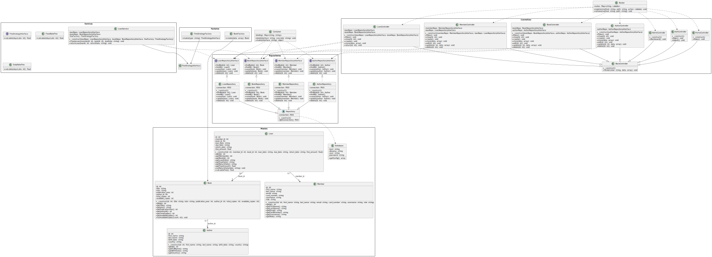

# Projekt: System Zarządzania Biblioteką „Library_app”

## 1. Cel projektu
Celem projektu jest stworzenie kompletnego systemu informatycznego do zarządzania biblioteką, który umożliwia:
- Rejestrację, edycję i przeglądanie zasobów (książek oraz autorów).
- Rejestrację i zarządzanie kontami czytelników (członków biblioteki).
- Obsługę procesu wypożyczeń (tworzenie wypożyczeń, zwroty, naliczanie kar).
- Przeglądanie historii wypożyczeń i generowanie prostych raportów dotyczących zaległości i kar.
- Zapewnienie prostego, intuicyjnego interfejsu webowego, dostępnego poprzez przeglądarkę.

System został zrealizowany w oparciu o wzorce projektowe i architektoniczne promujące czytelność, elastyczność oraz łatwość rozbudowy. Projekt obejmuje kompletny opis architektury, strukturę katalogów, diagram UML oraz instrukcję uruchomienia w kontenerach Docker.

---

## 2. Funkcjonalności
1. **Zarządzanie książkami i autorami**  
   - Dodawanie nowej książki: tytuł, autor, rok wydania, liczba egzemplarzy.  
   - Edycja danych książki (np. zmiana liczby egzemplarzy lub informacji o wydaniu).  
   - Usuwanie książek (jeśli nie są aktualnie wypożyczone).  
   - Przeglądanie listy wszystkich książek (filtracja i sortowanie według tytułu, autora lub roku wydania).  
   - Dodawanie i edycja danych autorów (imię, nazwisko, ewentualnie biografia).

2. **Rejestracja i obsługa czytelników (członków biblioteki)**  
   - Rejestracja nowego czytelnika: imię, nazwisko, PESEL lub inny identyfikator, adres e-mail.  
   - Edycja danych czytelnika (aktualizacja adresu e-mail, zmiana danych kontaktowych).  
   - Przeglądanie listy czytelników oraz szczegółów konkretnego konta (wypożyczenia w toku, historia kar).

3. **Proces wypożyczeń**  
   - Tworzenie wypożyczenia: wybór czytelnika oraz dostępnej książki.  
   - Ograniczenie liczby jednoczesnych wypożyczeń według ustalonego limitu (np. max 5 książek na czytelnika).  
   - Automatyczne sprawdzenie dostępności egzemplarzy (jeśli wszystkie egzemplarze są wypożyczone, system uniemożliwia kolejne wypożyczenia danego tytułu).  
   - Generowanie informacji o dacie zwrotu (np. 30 dni od daty wypożyczenia).

4. **Obsługa zwrotów i naliczanie kar**  
   - Zwracanie książek: aktualizacja stanu egzemplarzy, obliczenie dni opóźnienia.  
   - Implementacja różnych strategii naliczania kar (wzorzec strategii):  
     - Kara stała (np. 1 zł/dzień opóźnienia).  
     - Kara procentowa (np. 0,5% wartości książki za każdy dzień).  
     - Kara rosnąca (np. 1 zł/dzień przez pierwsze 7 dni, potem 2 zł/dzień).  
   - Rejestracja i podgląd aktualnej kwoty zadłużenia czytelnika.

5. **Historia wypożyczeń i raporty**  
   - Wyświetlanie pełnej historii wypożyczeń dla konkretnego czytelnika lub dla całej biblioteki.  
   - Podsumowanie aktualnych zaległości (lista czytelników z nieuregulowanymi karami).  
   - Prosty raport: lista książek najczęściej wypożyczanych w wybranym przedziale czasowym.

6. **Interfejs webowy (widoki)**  
   - Strona główna z odnośnikami do modułów: Książki, Czytelnicy, Wypożyczenia.  
   - Formularze dodawania/edycji (książka, czytelnik, wypożyczenie).  
   - Responsywny układ bazujący na prostym arkuszu stylów CSS, umożliwiający podstawowe filtrowanie i sortowanie danych.

---

## 3. Architektura systemu
System został zaimplementowany w języku PHP 8.x z użyciem prostego frameworka własnej konstrukcji, opierając się na wzorcu **MVC (Model-View-Controller)**. Całość uruchamiana jest w kontenerach Docker (nginx + PHP-FPM + MySQL).

### 3.1. Warstwa modelu (Model)
- **Klasy encji**:  
  - `Book` – reprezentuje książkę (pola: id, tytuł, autor_id, rok_wydania, liczba_egzemplarzy).  
  - `Author` – reprezentuje autora (pola: id, imię, nazwisko).  
  - `Member` – reprezentuje czytelnika (pola: id, imię, nazwisko, pesel, email).  
  - `Loan` – reprezentuje wypożyczenie (pola: id, member_id, book_id, data_wypożyczenia, data_zwrotu, kara).

- **Klasa `Database`** (Singleton lub poprzez kontener DI):  
  - Zapewnia pojedyncze połączenie PDO z bazą MySQL (parametry połączenia pobierane z pliku `.env` lub stałych w kodzie).  
  - Metody do przygotowywania i wykonywania zapytań SQL.

### 3.2. Warstwa dostępu do danych (Repository)
- Zastosowano **Repository Pattern**:  
  - Dla każdej encji istnieje interfejs (np. `BookRepositoryInterface`) definiujący metody: `findAll()`, `findById($id)`, `save($book)`, `delete($id)`, `findByAuthor($authorId)`.  
  - Klasy implementujące (np. `BookRepository`) korzystają z obiektu `Database`, przygotowują zapytania SQL i mapują wyniki na obiekty encji.  
  - Klasa bazowa `Repository` zawiera wspólne funkcje, np. mapowanie wiersza na obiekt lub wykonywanie zapytań uproszczonych.

### 3.3. Warstwa logiki aplikacji (Controller / Service)
- **Kontrolery**:  
  - `BookController` – odpowiada za żądania związane z książkami (lista, dodawanie, edycja, usuwanie, szczegóły).  
  - `MemberController` – obsługuje rejestrację, edycję i podgląd czytelników.  
  - `LoanController` – zarządza wypożyczeniami: tworzenie nowego wypożyczenia, zwrot, wyświetlenie historii.  
  - `HomeController` – przekierowuje do modułów i generuje widok główny.

- **Dependency Injection / Kontener usług**:  
  - Klasa `Container` rejestruje powiązania interfejs → implementacja (np. `BookRepositoryInterface` → `BookRepository`).  
  - Kontener wstrzykuje zależności do kontrolerów, np. `BookController` otrzymuje w konstruktorze instancję `BookRepositoryInterface`.  
  - Ułatwia to testowanie i późniejszą modyfikację implementacji bez zmiany kodu kontrolerów.

- **Fabryki i strategie**:  
  - `BookFactory` – odpowiedzialna za tworzenie instancji `Book` na podstawie danych formularza (walidacja, ustawienie pól domyślnych).  
  - `FineStrategyFactory` – zwraca odpowiednią klasę strategii obliczania kary (`FixedFineStrategy`, `PercentageFineStrategy`, `IncreasingFineStrategy`).  
  - Każda strategia implementuje wspólny interfejs (`FineStrategyInterface`).

### 3.4. Warstwa prezentacji (View)
- Widoki w PHP generują HTML z wykorzystaniem prostych pętli i warunków (`foreach`, `if`).  
- Pliki widoków podzielone są na katalogi `views/books/`, `views/members/`, `views/loans/`.  
- Główny plik `public/index.php` pełni rolę front controller’a: inicjalizuje autoloader, kontener DI i przekazuje sterowanie do odpowiedniego kontrolera na podstawie adresu URL (definicje tras w `routes.php`).

---

## 4. Zastosowane wzorce projektowe
1. **MVC (Model-View-Controller)**  
   - Wyraźny podział kodu na warstwy: Model (dane), View (prezentacja), Controller (logika).

2. **Repository Pattern**  
   - Oddzielenie logiki dostępu do bazy danych od warstwy biznesowej.  
   - Interfejsy repozytoriów umożliwiają podmianę implementacji (np. testy z mockiem).

3. **Factory Pattern**  
   - `BookFactory` i `FineStrategyFactory` upraszczają tworzenie obiektów, centralizują walidację i reguły inicjalizacji.

4. **Strategy Pattern**  
   - Różne algorytmy naliczania kar (stała, procentowa, rosnąca) są enkapsulowane w odrębnych klasach.  
   - `FineStrategyFactory` wybiera strategię w zależności od parametrów wypożyczenia.

5. **Dependency Injection**  
   - Klasa `Container` odpowiada za wstrzykiwanie zależności do kontrolerów i repozytoriów.  
   - Umożliwia łatwe testowanie oraz rozbudowę aplikacji bez modyfikacji kodu wysokiego poziomu.

6. **Singleton**  
   - Klasa `Database` zapewnia jedno, współdzielone połączenie PDO z bazą.  
   - Dzięki temu nie trzeba tworzyć wielu instancji połączenia przy każdym wywołaniu repozytorium.

---

## 5. Struktura katalogów
Projekt jest podzielony na kilka głównych katalogów:

* **app/** – logika aplikacji (kontrolery, modele i repozytoria).
* **public/** – pliki dostępne publicznie, m.in. `index.php` i arkusz stylów.
* **docker/** – konfiguracja kontenerów PHP i nginx.
* **docs/** – dokumentacja oraz diagram UML.
* **init.sql** – skrypt tworzący strukturę bazy danych.
* **docker-compose.yml** – definicja usług Docker Compose.

## 6. Diagram UML klas

W katalogu `docs/uml.svg` znajduje się pełny diagram UML obrazujący relacje pomiędzy klasami:
- Relacje dziedziczenia:  
  - `BookRepository` dziedziczy po `Repository`.  
  - Klasy strategii naliczania kar (`FixedFineStrategy`, `PercentageFineStrategy`, `IncreasingFineStrategy`) implementują `FineStrategyInterface`.  
- Relacje asocjacji:  
  - `Loan` posiada pola `member_id` oraz `book_id`, wskazujące powiązania z encjami `Member` i `Book`.  
  - `Book` jest powiązany z `Author` poprzez `author_id`.  
- Klasa `Container` ukazuje zależności do repozytoriów i kontrolerów (wstrzykiwanie interfejsów repozytoriów).

Diagram UML został rozszerzony o kluczowe pola i metody klas (np. `findAll()`, `save()`, `calculateFine()`), dzięki czemu lepiej widać strukturę systemu.

---
## 7. Uruchomienie projektu w Dockerze
Aby uruchomic system lokalnie, nalezy miec zainstalowane Docker oraz Docker Compose. W katalogu glownym projektu wykonaj:

```bash
docker-compose up --build
```
(opcjonalnie) Załaduj `init.sql` do bazy:

   ```bash
   type .\init.sql | docker exec -i library_db psql -U postgres -d library_db
   ```

Po zakonczeniu budowania kontenerow aplikacja bedzie dostepna pod adresem [http://localhost:8080](http://localhost:8080).


